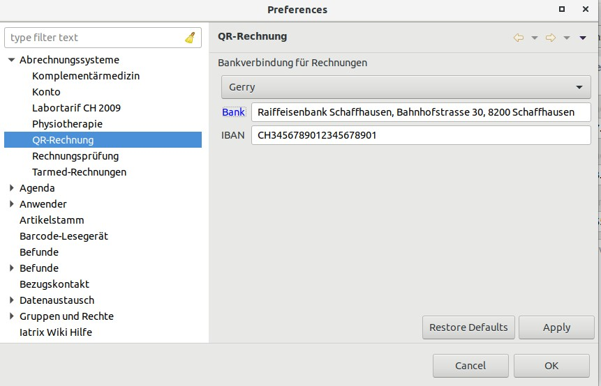

# QR-Rechnungen

## Wozu?

Ab 2018 wurde in der Schweiz schrittweise der ISO 20022 Standard zur automatisierten Zahlungsverarbeitung eingeführt.
Für uns einfache Leute am wichtigsten sind erstens die Zahlungseingangs-Dateien, welche vom bisherigen Zeilenbasierten ESR-Format
auf ein XML-basiertes Format umgestellt wurden.
Elexis kann in der Version 3.4/Ungrad2018  solche Dateien bereits verarbeiten. Achtung: Mit früheren Elexis Versionen können Sie Zahlungen nur noch so lange automatisch verbuchen, bis Ihre Bank auf Iso 20022 umgestellt hat.

In einem zweiten Schritt, der auf Mitte/Ende 2018 angekündigt ist, sollen auch die Einzahlungsscheine geändert werden. Anstelle des Roten/rosa ESR-Teils soll ein auf beliebiges Papier druckbarer QR-Code kommen. Das scheint auf den ersten Blick zunächst mal eine Verbesserung: Es erspart uns, Drucker mit zwei Schächten anzuschaffen und zwei Sorten Papier vorzuhalten.

Allerdings schreibt der Standard vor, dass der Zahlteil mit einer Perforation vom oberen Teil abzutrennen ist. Wir brauchen also doch verschiedene Papiertypen. Nur wenn die Rechnung als PDF versandt wird, gilt auch eine gestrichelte Linie und ein Hinweis in Form eines Scherensymbols oder des Texts "Vor dem Einzahlen abzutrennen" als zulässig.

*Achtung*: Das Datenformat wurde geändert. Die mit Elexis Ungrad 2018 erstellbaren QR-Codes sind nicht mehr gültig. Aktuell gilt das Format 2.0. Sie müssen also zumindest das QR-Plugin auf Ungrad2020 updaten, falls Sie schon eine frühere Version verwendet haben. 
 
 ## Installation

 Sie können ch.elexis.ungrad.qrbills über die Software-Installation in Elexis Ungrad 2018, 2020 oder Elexis 3.7 installieren.
 Ausserdem muss das feature "Elexis Swiss OpenSource Feature" aus der Gruppe "Basispakete" installiert sein.

 ## Konfiguration

 QrBills benötigt die qrIBAN Nummer Ihres Kontos (Das ist nicht dieselbe, wie die "alte" IBAN!). Gehen Sie auf Datei-Einstellungen - Abrechnungssysteme - QR-Rechnung und geben Sie die entsprechenden Daten ein.
 
 

 Beachten Sie, dass die derzeitige Spezifikation QR-Rechnung von ISO 20022 nur IBAN-Nummern mit CH und LI Präfix zulässt.
 
 Sie können dieses Plugin zur Rechnungsausgabe für jedes andere Abrechnungssystem verwenden:
 
 
 

 ## Nutzung
 
 Wählen Sie bei der Rechnungsausgabe das Ziel "Rechnung mit QR-Code". Im Feld darunter tragen Sie das Verzeichnis ein, in das die Rechnungen
 geschrieben werden sollen. 
 
 
 
 Die Rechnungen werden als id.html geschrieben, wobei für ID eine Kombination aus Patientennummer und Rechnungsnummer eingesetzt wird. In den meisten Fällen werden Sie die Rechnung aber nicht als HTML haben wollen, sondern entweder als PDF, um sie dem Patienten per Mail zu senden, oder Sie möchten sie zum Drucker schicken.
 
Im Feld "Nachbearbeitung" können Sie irgendein beliebiges Programm angeben, das die Rechnungen weiterverarbeitet. (Hier im Beispiel werden HTML zu PDF Rechnungen umgewandelt).


 ## Mögliche Probleme
 
 Die Übersetzung einer HTML Datei zum Drucker oder zu einer PDF-Datei ist nicht immer perfekt. Häufig spielen uns "intelligente" Optimierungen einen Streich. So versuchen manche Druckertreiber, die Seite zu verkleinern, damit sie in den Druckbereich (Seite ohne Ränder) des Druckers passt. Dies darf im Fall der QR-Rechnung aber nicht passieren, da die Grösse und Position aller Elemente innerhalb enger Grenzen vorgeschrieben ist. Kontrollieren Sie das, indem Sie nach enem Probeausdruck nachmessen, ob der "Zahlteil" wirklich Format A6 ist (148x105mm), und ob er wirklich in der rechten unteren Ecke der Seite (nicht des Druckbereichs!) platziert ist.
 
Wenn die Positionierung und Grösse nicht stimmt, damm kommen automatische Verarbeitungssysteme damit nicht zurecht, was für Sie zu erhöhten Verarbeitungskosten führen kann.

Lesen Sie dann den QR Code mit irgendeiner QR-Applikation auf Ihrem Smartphone ein und prüfen Sie, ob die Rechnungsdaten korrekt eingelesen werden. Die ersten drei Zeilen müssen SPC, 0200 und 1 sein, darunter folgen die IBAN und die weiteren Rechnungsdetails, hier ein Beispiel:

```
SPC
0200
1
CH8281479000001545305
Weirich Gerry
Rietstrasse
30
8200
Schaffhausen
CH


155.15
CHF
2018-03-15
Testperson Armeswesen
Hintergasse
17
9999
Elexikon
CH
QRR
000000000000000000000456007
3 Konsultationen von 07.05.2016 bis 03.01.2017
```

(Die Papierversion dieser Rechnung sehen Sie unter [example.pdf](./example.pdf) )

